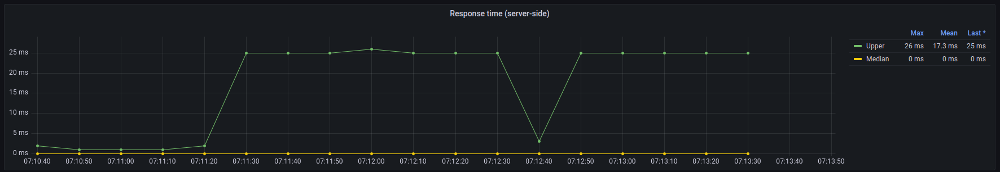

# Trabajo Práctico 1

## Servicios

En esta primera sección del trabajo práctico comparamos, mediante distintos escenarios de pruebas, los comportamientos de dos servicios funcionalmente iguales, pero con distintas configuraciones de deployment. Ambos servicios se acceden a través de nginx y están implementados en Node.js; su única diferencia es que el primero tiene sólo un proceso corriendo, mientras que el segundo está replicado en múltiples contenedores (configurado en 5 réplicas) y con un balanceador de carga a nivel de nginx.

Para la obtención de información hemos utilizado distintas herramientas (Artillery, StatsD, CAdvisor, Graphite y Grafana) para armar escenarios de carga, obtener distintos tipos de métricas y poder visualizarlas a lo largo de una ventana de tiempo, de manera tal de poder analizarlas y sacar conclusiones.  

En primer lugar, al levantar la aplicación tenemos a nginx corriendo en `localhost:5555`. El primer servicio está sobre `/`, y el segundo en `/many`. Los endpoints que proveen son:

- `/ping`: Un simple healtcheck. Devuelve un número identificador del proceso, para poder confirmar que el servicio replicado esta contestando desde distintos lugares.
- `/work?n=15`: Una manera de representar cálculos pesados. Computa y devuelve los primeros n-mil dígitos de pi, siendo `n` configurable.
- `/sync`: Invoca el servicio sincrónico `bbox` (explicado más adelante)
- `/async`: Invoca el servicio asincrónico `bbox`

```zsh
$ make up # levantamos los múltiples contenedores con make up, que internamente llama a docker-compose
Creating network "7573-arqui_default" with the default driver
Creating 7573-arqui_grafana_1  ... done
Creating 7573-arqui_bbox_1     ... done
Creating 7573-arqui_node_1     ... done
Creating 7573-arqui_node_2     ... done
Creating 7573-arqui_node_3     ... done
Creating 7573-arqui_node_4     ... done
Creating 7573-arqui_node_5     ... done
Creating 7573-arqui_graphite_1 ... done
Creating 7573-arqui_nginx_1    ... done
Creating 7573-arqui_cadvisor_1 ... done

# Probemos ambos healthchecks
$ curl "localhost:5555/ping"
[28] pong
$ curl "localhost:5555/many/ping"
[99] pong

# Chequeemos que se contesta desde distintos procesos (por el número identificador)
$ for run in {1..7}; do curl localhost:5555/ping; done
[28] pong
[28] pong
[28] pong
[28] pong
[28] pong
[28] pong
[28] pong
$ for run in {1..7}; do curl localhost:5555/many/ping; done
[99] pong
[69] pong
[28] pong
[11] pong
[12] pong
[28] pong
[69] pong

# Testeemos todos los endpoints
$ curl "localhost:5555/work"
31415926...
$ curl "localhost:5555/sync"
Hello world!
$ curl "localhost:5555/async"
Hello world!

# Mostremos un poco cuánto trabaja el calculador de Pi
# mil digitos -> menos de un segundo
$ time curl "localhost:5555/work?n=1"
0,01s user 0,01s system 50% cpu 0,037 total
# 10 mil digitos -> menos de un segundo...
$ time curl "localhost:5555/work?n=10"
0,00s user 0,00s system 2% cpu 0,297 total
# 100 mil digitos -> veinte segundos!
$ time curl "localhost:5555/work?n=100"
0,00s user 0,00s system 0% cpu 20,632 total
```

## Performance Testing

Para poder llevar a cabo la comparación entre servicios hemos realizado pruebas de carga y de estrés.
### Load testing

Se incrementa la carga constantemente en el sistema hasta llegar a un valor umbral.  
Para cada endpoint se corren las siguientes etapas:
1. **WarmUp**: durante un período de 30 segundos, se envían 5 requests por segundo.
2. **RampUp**: durante un período de 30 segundos, se envían 5 requests por segundo incrementando hasta 30 requests por segundo.
3. **Plain**: durante un período de 120 segundos, se envían 30 requests por segundo
4. **Cleanup**: durante un período de 15 segundos, no se envían requests.

### Stress testing
Se carga al sistema con un gran número de usuarios/procesos concurrentes que no pueden ser soportados, para comprobar la estabilidad del mismo. Por esto mismo, las etapas son similares, pero el RampUp y el Plain mucho más intensos.  
Para cada endpoint se corren las siguientes etapas:
1. **WarmUp**: durante un período de 30 segundos, se envían 5 requests por segundo.
2. **RampUp**: durante un período de 60 segundos, se envían 5 requests por segundo incrementando hasta 600 requests por segundo.
3. **Plain**: durante un período de 120 segundos, se envían 600 requests por segundo
4. **Cleanup**: durante un período de 15 segundos, no se envían requests.

- https://www.softwaretestingclass.com/what-is-performance-testing/
- Explicar y mostrar ejemplos de artillery
- Pelar grafos de grafana y demas

## Ping
Es un simple healthcheck por lo que su procesamiento es mínimo, por ende se espera un tiempo de respuesta bajo y un bajo consumo de memoria y cpu.

### Un nodo  

### Load Testing

**Escenarios creados**

Se aprecia el warm up con una duración de 30 segundos, seguido del ramp up durante otros 30 segundos, donde la cantidad de requests aumenta de 5 hasta llegar a 30 requests por segundo, dando lugar a la meseta típica de una prueba de carga, donde se mantiene la frecuencia de requests hasta el final.
En el eje y se ven los valores aumentados en un factor de 10 dado que se muestran los requests por segundo en los últimos 10 segundos.

**Requests completados, pendientes y fallidos**

En este caso todos los requests fueron completados con éxitos y no hubo errores ni pendientes, lo que se debe al bajo procesamiento que tiene este endpoint.

**Tiempo de respuesta visto por el cliente**


**Tiempo de respuesta visto por el servicio**


Se pueden apreciar los tiempos de respuesta tanto de la perspectiva del cliente como del servicio y, a su vez, para cada uno se tiene la mediana y el máximo.
En ambos gráficos se observa que la mediana tiene un valor bajo, lo cual se corresponde con el bajo procesamiento que tiene el endpoint ping.  
Por otro lado, el máximo del lado del servicio también se condice con el máximo del lado del cliente, que van desfasados 10 segundos porque el servicio pushea la métrica antes que el cliente. Congruentemente, mirando el gráfico de recursos se termina de concluir que el máximo uso de CPU se produce durante el pico de tiempo de respuesta.

**Recursos utilizados**

Durante el transcurso de toda la prueba, el uso de CPU fluctúa, pero se mantiene bajo y en concordancia con el análisis de los gráficos anteriores. En cuanto a la memoria, se mantiene constante puesto que no se realizan operaciones de escritura.

### Replicado (Cinco nodos)
### Load Testing

**Requests completados, pendientes y fallidos**


**Tiempo de respuesta visto por el cliente**


**Tiempo de respuesta visto por el servicio**


**Recursos utilizados**


## Work

### Un nodo  

### Load Testing

**Requests completados, pendientes y fallidos**


**Tiempo de respuesta visto por el cliente**


**Tiempo de respuesta visto por el servicio**


**Recursos utilizados**


### Replicado (Cinco nodos)
### Load Testing

**Requests completados, pendientes y fallidos**


**Tiempo de respuesta visto por el cliente**


**Tiempo de respuesta visto por el servicio**


**Recursos utilizados**


## Sync

### Un nodo  

### Load Testing

**Requests completados, pendientes y fallidos**


**Tiempo de respuesta visto por el cliente**


**Tiempo de respuesta visto por el servicio**


**Recursos utilizados**


### Replicado (Cinco nodos)
### Load Testing

**Requests completados, pendientes y fallidos**


**Tiempo de respuesta visto por el cliente**


**Tiempo de respuesta visto por el servicio**


**Recursos utilizados**


## Async

### Un nodo  

### Load Testing

**Requests completados, pendientes y fallidos**


**Tiempo de respuesta visto por el cliente**


**Tiempo de respuesta visto por el servicio**


**Recursos utilizados**


### Replicado (Cinco nodos)
### Load Testing

**Requests completados, pendientes y fallidos**


**Tiempo de respuesta visto por el cliente**


**Tiempo de respuesta visto por el servicio**


**Recursos utilizados**


## Vista Components & Connectors

Se presentan a continuación dos diagramas de Components & Connectors, uno para el caso de un nodo y otro para el caso de cinco nodos.


En este primer escenario, para una sola replica del servidor, podemos observar que el mismo recibe llamados HTTP que vienen del balanceador de carga Nginx, y a este load balancer también le llegan llamadas HTTP (al puerto 5555). Estos llamados que recibe Nginx pueden realizarse a través de Artillery, donde simulamos escenarios de carga, o desde la terminal, desde donde un usuario puede hacer una request con el comando "curl". Si el llamado que se le hizo al servidor, independientemente del origen, es a los endpoints "ping" o "work", simplemente devuelve la response sin hacer mas llamadas adicionales. En cambio, si el endpoint llamado es "sync" o "async", se debe realizar otra llamada HTTP a alguno de los servicios bbox proporcionados por la cátedra (se llama al que corresponda dependiendo si el endpoint fue "sync" o "async"), que darán su respuesta y allí el server podrá también dar su response.


Este diagrama muestra cuando existen cinco replicas del servidor. El procedimiento es casi exactamente igual, pero ahora el load balancer Nginx tiene que repartir las requests entre las cinco replicas del servidor. Para esto, Nginx tiene un algoritmo de balanceo de carga que reparte dichas requests entre las replicas de manera equitativa. En este caso, el load balancer también recibe llamadas HTTP desde Artillery y desde la terminal, y la replica que procese esa request puede llamar a los servicios bbox de ser necesario. Igual que en el caso anterior, todas las llamadas son HTTP.

## Servicio `bbox`

```
Análisis y caracterización

Deberán caracterizar cada servicio mirando tres propiedades:

    Sincrónico / Asincrónico: Uno de los servicios se comportará de manera sincrónica, y el otro de manera asincrónica. Deberán detectar de qué tipo es cada uno.
    Cantidad de workers (en el caso sincrónico): El servicio sincrónico está implementado con una cantidad de workers. Deberán buscar algún indicio sobre cuál es esta cantidad.
    Demora en responder: Cada servicio demora un tiempo en responder, que puede ser igual o distinto entre ellos. Deberán obtener este valor para cada uno.

Las herramientas para este análisis son las mismas que usaron en la Sección 1. Deben generar carga que ponga en relieve las características de cada servicio, haciendo uso de gráficos para mostrar puntos interesantes de la prueba. Incluyan en el informe una descripción de la/s estrategia/s utilizada/s. Recomendamos, por claridad, agregar una tabla al final de la sección con los resultados para cada uno.
```

## Caso de estudio: Sistema de inscripciones

¿Cómo debería comportarse un sistema de inscripciones facultativo? Hagamos un par de suposiciones, y centremonos en intentar simular un sistema de inscripciones para FIUBA.

¿Con cuanta carga estamos trabajando? Basado en algunas fuentes[^1] podemos tomar como supuestos para nuestro sistema simulado que vamos a trabajar con una carga de 10 mil alumnos. Cada uno de estos alumnos se inscribirán en entre 3 y 5 materias.

Desde el punto de vista del usuario, secuencialmente:

- Iniciar sesión - `/iniciar_sesion`
- Inscribirse a n materias:
    - Ver la lista de materias disponibles - `/ver_materias_disponibles`
    - Inscribirse en una materia - `/inscripcion`
- Cerrar sesión[^2] - `/cerrar_sesion`

Desde el punto de vista del sistema:

- A nuestros 10 mil alumnos los dividimos uniformemente en franjas horarias de 30 minutos (las prioridades), en una semana laboral:
    - De 9hs a 18hs de un día tenemos 18 franjas
    - De lunes a viernes tenemos 18 * 5 => 90 franjas
    - 10 mil alumnos en 90 franjas => ~100 alumnos activos en el sistema en cualquier (media) hora dada[^3]

- Asumiendo la ansiedad del alumnado, vamos a asumir que, si bien hay 30 minutos para inscribirse, la mayoría de los alumnos de una franja horaria se inscribiran en los primeros 10 minutos de la franja, y el resto lo hará mas relajadamente en lo que queda de la media hora.

Habiendo marcado todas estas suposiciones e hipótesis, lo que pretendemos es:

- Ver en nuestros gráficos picos de _hits_ a los distintos endpoints al comienzo de cada franja horaria y luego teniendo hits a un ritmo decente. Ningún tipo de hit en hora no laboral.
- Los endpoints simularlos como:
    - `/iniciar_sesion`: Un endpoint con trabajo liviano (consiste principalmente de chequear la contraseña del usuario)
    - `/ver_materias_disponibles`: Un endpoint sincrónico que depende de un servicio externo (preguntarle a la base de datos)
    - `/inscripcion`: Un endpoint con trabajo mediano, ya que debe ser una acción atómica para proveer control de concurrencia, para evitar que se anoten más alumnos que el cupo disponible
    - `/cerrar_sesion`: Un endpoint inmediato

Este escenario planteado se puede ver en `perf/siu.yaml` y se refiere a una sola franja horaria de 30 minutos con 100 alumnos.

[^1]: [Blog de Nico Paez](https://blog.nicopaez.com/2021/05/23/sobre-las-estadisticas-de-inscriptos-en-fiuba/) - [Padrón de Estudiantes Regulares 2022](https://cms.fi.uba.ar/uploads/PADRON_DEFINITIVO_ESTUDIANTES_2022_MESAS_1_429d2abc05.pdf) - [Infobae](https://www.infobae.com/educacion/2022/05/23/63-mil-anotados-al-cbc-de-la-uba-cuales-fueron-las-carreras-mas-elegidas-las-que-mas-crecieron-y-cayeron/)

[^2]: En previas versiones del SIU Guaraní habia un pequeño _flush_ de información al cerrar sesión, haciendo que sea un proceso más lento de lo que uno intuiría. Esto no lo vamos a modelar!

[^3]: No vamos a simular alumnos entrando al sistema fuera de su franja horaria (problema conocido del SIU Guaraní)
