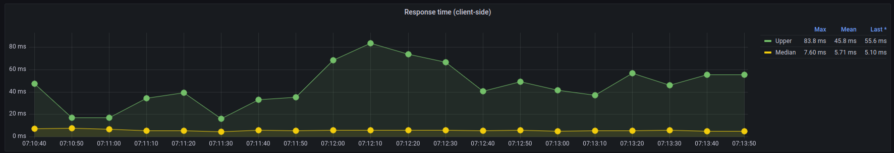

# Trabajo Práctico 1

## Servicios

En esta primera sección del trabajo práctico comparamos, mediante distintos escenarios de pruebas, los comportamientos de dos servicios funcionalmente iguales, pero con distintas configuraciones de deployment. Ambos servicios se acceden a través de nginx y están implementados en Node.js; su única diferencia es que el primero tiene sólo un proceso corriendo, mientras que el segundo está replicado en múltiples contenedores (configurado en 5 réplicas) y con un balanceador de carga a nivel de nginx.

Para la obtención de información hemos utilizado distintas herramientas (Artillery, StatsD, CAdvisor, Graphite y Grafana) para armar escenarios de carga, obtener distintos tipos de métricas y poder visualizarlas a lo largo de una ventana de tiempo, de manera tal de poder analizarlas y sacar conclusiones.

En primer lugar, al levantar la aplicación tenemos a nginx corriendo en `localhost:5555`. El primer servicio está sobre `/`, y el segundo en `/many`. Los endpoints que proveen son:

- `/ping`: Un simple healtcheck. Devuelve un número identificador del proceso, para poder confirmar que el servicio replicado esta contestando desde distintos lugares.
- `/work?n=15`: Una manera de representar cálculos pesados. Computa y devuelve los primeros n-mil dígitos de pi, siendo `n` configurable.
- `/sync`: Invoca el servicio sincrónico `bbox` (explicado más adelante)
- `/async`: Invoca el servicio asincrónico `bbox`

\newpage

```zsh
$ make up # levantamos los múltiples contenedores con make up, que internamente llama a docker-compose
Creating network "7573-arqui_default" with the default driver
Creating 7573-arqui_grafana_1  ... done
Creating 7573-arqui_bbox_1     ... done
Creating 7573-arqui_node_1     ... done
Creating 7573-arqui_graphite_1 ... done
Creating 7573-arqui_nginx_1    ... done
Creating 7573-arqui_cadvisor_1 ... done

# Probemos ambos healthchecks
$ curl "localhost:5555/ping"
[28] pong
$ curl "localhost:5555/many/ping"
[99] pong

# Chequeemos que se contesta desde distintos procesos (por el número identificador)
$ for run in {1..7}; do curl localhost:5555/ping; done
[28] pong
[28] pong
[28] pong
[28] pong
[28] pong
[28] pong
[28] pong
$ for run in {1..7}; do curl localhost:5555/many/ping; done
[99] pong
[69] pong
[28] pong
[11] pong
[12] pong
[28] pong
[69] pong

# Testeemos todos los endpoints
$ curl "localhost:5555/work"
31415926...
$ curl "localhost:5555/sync"
Hello world!
$ curl "localhost:5555/async"
Hello world!

# Mostremos un poco cuánto trabaja el calculador de Pi
# mil digitos -> menos de un segundo
$ time curl "localhost:5555/work?n=1"
0,01s user 0,01s system 50% cpu 0,037 total
# 10 mil digitos -> menos de un segundo...
$ time curl "localhost:5555/work?n=10"
0,00s user 0,00s system 2% cpu 0,297 total
# 100 mil digitos -> veinte segundos!
$ time curl "localhost:5555/work?n=100"
0,00s user 0,00s system 0% cpu 20,632 total
```

## Performance Testing

Para poder llevar a cabo la comparación entre servicios hemos realizado pruebas de carga y de estrés.

### Load testing

Se incrementa la carga constantemente en el sistema hasta llegar a un valor umbral.

Para cada endpoint se corren las siguientes etapas:

1. **WarmUp**: durante un período de 30 segundos, se envían 5 requests por segundo.
2. **RampUp**: durante un período de 30 segundos, se envían 5 requests por segundo incrementando hasta 30 requests por segundo.
3. **Plain**: durante un período de 120 segundos, se envían 30 requests por segundo
4. **Cleanup**: durante un período de 15 segundos, no se envían requests.

### Stress testing

Se carga al sistema con un gran número de usuarios/procesos concurrentes que no pueden ser soportados, para comprobar la estabilidad del mismo. Por esto mismo, las etapas son similares, pero el RampUp y el Plain mucho más intensos.

Para cada endpoint se corren las siguientes etapas:

1. **WarmUp**: durante un período de 30 segundos, se envían 5 requests por segundo.
2. **RampUp**: durante un período de 60 segundos, se envían 5 requests por segundo incrementando hasta 600 requests por segundo.
3. **Plain**: durante un período de 120 segundos, se envían 600 requests por segundo
4. **Cleanup**: durante un período de 15 segundos, no se envían requests.

## Ping

Es un simple healthcheck por lo que su procesamiento es mínimo, por ende se espera un tiempo de respuesta bajo y un bajo consumo de memoria y cpu.

### Un nodo

### Load Testing

**Escenarios creados**


Se aprecia el warm up con una duración de 30 segundos, seguido del ramp up durante otros 30 segundos, donde la cantidad de requests aumenta de 5 hasta llegar a 30 requests por segundo, dando lugar a la meseta típica de una prueba de carga, donde se mantiene la frecuencia de requests hasta el final.

En el eje y se ven los valores aumentados en un factor de 10 dado que se muestran los requests por segundo en los últimos 10 segundos.

**Requests completados, pendientes y fallidos**


En este caso todos los requests fueron completados con éxitos y no hubo errores ni pendientes, lo que se debe al bajo procesamiento que tiene este endpoint.

**Tiempo de respuesta visto por el cliente**



**Tiempo de respuesta visto por el servicio**


Se pueden apreciar los tiempos de respuesta tanto de la perspectiva del cliente como del servicio y, a su vez, para cada uno se tiene la mediana y el máximo.

En ambos gráficos se observa que la mediana tiene un valor bajo, lo cual se corresponde con el bajo procesamiento que tiene el endpoint ping.

Por otro lado, el máximo del lado del servicio también se condice con el máximo del lado del cliente, que van desfasados 10 segundos porque el servicio pushea la métrica antes que el cliente. Congruentemente, mirando el gráfico de recursos se termina de concluir que el máximo uso de CPU se produce durante el pico de tiempo de respuesta.

**Recursos utilizados**


Durante el transcurso de toda la prueba, el uso de CPU fluctúa, pero se mantiene bajo y en concordancia con el análisis de los gráficos anteriores. En cuanto a la memoria, se mantiene constante puesto que no se realizan operaciones de escritura.

### Replicado (Cinco nodos)

**Requests completados, pendientes y fallidos**


De igual manera que con un solo nodo, en este caso se completan todas las requests que van llegando a cada segundo, lo cual es esperado por la simplicidad del endpoint.

**Tiempo de respuesta visto por el cliente**


**Tiempo de respuesta visto por el servicio**


Los tiempos de respuesta se mantienen muy bajos durante toda la prueba y coherentes entre lo que figura del lado del cliente y del lado del servidor, puesto que los picos se condicen.


**Recursos utilizados**


En este caso se muestran los recursos utilizados por un solo nodo, los cuales se mantienen muy bajos a pesar de la carga y nuevamente se debe a la naturaleza simple del endpoint.

## Work

### Un nodo

### Load Testing

**Requests completados, pendientes y fallidos**


Se puede observar que todos los requests fueron completados con éxitos y no hubo errores ni pendientes. Aunque este proceso no es tan trivial como el ping, tampoco requiere demasiado procesamiento. 

**Tiempo de respuesta visto por el cliente**


**Tiempo de respuesta visto por el servicio**


Acá también se pueden apreciar los tiempos de respuesta del cliente y del servicio, además de la mediana y el máximo de cada uno.

La mediana tiene un valor mayor al del ping dado que el procesamiento de este endpoint demanda un mayor tiempo.

Se puede observar que los tiempos de respuesta tanto del cliente como del servidor se mantienen prácticamente constantes durante todo el test de carga, creciendo ligeramente cuando se aumenta la carga. 


**Recursos utilizados**


En este gráfico se puede observar que el uso de CPU fluctúa, pero se sigue manteniendo bajo y coincide con el análisis de los gráficos mostrados anteriormente. La memoria, se mantiene constante dado que no se realizan operaciones de escritura.

### Replicado (Cinco nodos)

### Load Testing

**Requests completados, pendientes y fallidos**


Se puede observar que, como sucede con un nodo, todos los requests se completan de manera exitosa y no existen errores ni pendientes.

**Tiempo de respuesta visto por el cliente**


**Tiempo de respuesta visto por el servicio**


Los tiempos de respuesta se mantienen bajos y condice lo observado para el cliente y para el servidor, comenzando bajo y subiendo ligeramente en la mitad de la prueba. 

**Recursos utilizados**


Se muestran los recursos utilizados por un solo nodo, que se mantienen muy bajos a pesar de la carga y nuevamente se debe a que el endpoint no necesita utilizar gran cantidad de CPU. 

## Sync/Async

La sección 2 de este trabajo se concentra en la funcionalidad de los endpoints `sync` y `async`, por lo que acá solamente analizamos los recursos utilizados.


## Vista Components & Connectors

Se presentan a continuación dos diagramas de Components & Connectors, uno para el caso de un nodo y otro para el caso de cinco nodos.

{ width=250px }

En este primer escenario, para una sola replica del servidor, podemos observar que el mismo recibe llamados `HTTP` que vienen del balanceador de carga Nginx, y a este load balancer también le llegan llamadas `HTTP` (al puerto `5555`). Estos llamados que recibe Nginx pueden realizarse a través de Artillery, donde simulamos escenarios de carga, o desde la terminal, desde donde un usuario puede hacer una request con el comando "curl".

Si el llamado que se le hizo al servidor, independientemente del origen, es a los endpoints `ping` o `work`, simplemente devuelve la response sin hacer mas llamadas adicionales. En cambio, si el endpoint llamado es `sync` o `async`, se debe realizar otra llamada `HTTP` a alguno de los servicios `bbox` proporcionados por la cátedra (se llama al que corresponda dependiendo si el endpoint fue `sync` o `async`), que darán su respuesta y allí el server podrá también dar su response.

{ width=350px }

Este diagrama muestra cuando existen cinco replicas del servidor. El procedimiento es casi exactamente igual, pero ahora el load balancer Nginx tiene que repartir las requests entre las cinco replicas del servidor. Para esto, Nginx tiene un algoritmo de balanceo de carga que reparte dichas requests entre las replicas de manera equitativa. En este caso, el load balancer también recibe llamadas `HTTP` desde Artillery y desde la terminal, y la replica que procese esa request puede llamar a los servicios `bbox` de ser necesario. Igual que en el caso anterior, todas las llamadas son `HTTP`.

\newpage

## Servicio `bbox`

Decidimos en un principio nombrar a un servicio como `sync` y otro como `async` ya que la existencia de éstos era la única información que teníamos, pero a continuación veremos si realmente se comportan de esa manera.

**Sincrónico/Asincrónico**


Recordemos que podemos distinguir entre un servicio sincrónico y uno asincrónico ya que el primero será aquel que espere a que finalice su ejecución para devolver una respuesta, y el segundo termina antes de tener esa respuesta. Viendo los gráficos, se puede observar que el servicio `sync` tiene valores bastante más bajos en cuanto a la cantidad de requests que fueron completados entonces podemos afirmar que los nombres dispuestos a cada uno de los servicios son los correctos.

**Cantidad de workers (en el caso sincrónico)**

Utilizamos Apache Benchmark para medir rendimientos de estos servicios. Comenzamos consultando información para un único request y se obtuvo lo siguiente:

{ width=400px }

Comenzamos a aumentar la cantidad de request para ver algún cambio en el rendimiento, observamos un cambio cuando se superan los 14 requests:

{ width=400px }

A los 15 requests vemos que se duplica el tiempo de respuesta, entonces suponemos que hay 14 workers ya que hasta ese punto cada uno se encarga de un request distinto y cuando se supera, hay que esperar que termine para poder responder al siguiente.

**Demora en responder**


\newpage

## Caso de estudio: Sistema de inscripciones

¿Cómo debería comportarse un sistema de inscripciones facultativo? Hagamos un par de suposiciones, y centremonos en intentar simular un sistema de inscripciones para FIUBA.

¿Con cuanta carga estamos trabajando? Basado en algunas fuentes[^1] podemos tomar como supuestos para nuestro sistema simulado que vamos a trabajar con una carga de 10 mil alumnos. Cada uno de estos alumnos se inscriben en entre 3 y 5 materias.

Desde el punto de vista del usuario, secuencialmente:

- Iniciar sesión - `/iniciar_sesion`
- Ver la lista de materias disponibles - `/ver_materias_disponibles`
- Inscribirse a `n` materias:
    - Inscribirse en una materia - `/inscripcion`
- Cerrar sesión[^2] - `/cerrar_sesion`

Desde el punto de vista del sistema:

- A nuestros 10 mil alumnos los dividimos uniformemente en franjas horarias de 30 minutos (las prioridades), en una semana laboral:
    - De 9hs a 18hs de un día tenemos 18 franjas
    - De lunes a viernes tenemos 18 * 5 => 90 franjas
    - 10 mil alumnos en 90 franjas => ~100 inicios de sesión cada media hora[^3]

- Conociendo la ansiedad del alumnado, vamos a asumir que, si bien hay 30 minutos para inscribirse, la mayoría de los alumnos se inscriben al comienzo de su franja horaria.

Los endpoints los simularemos como:

- `/iniciar_sesion`: Un endpoint con trabajo liviano (consiste principalmente de chequear la contraseña del usuario)
- `/ver_materias_disponibles`: Un endpoint sincrónico que depende de un servicio externo (preguntarle a la base de datos)
- `/inscripcion`: Un endpoint con trabajo mediano, ya que debe ser una acción atómica para proveer control de concurrencia, para evitar que se anoten más alumnos que el cupo disponible
- `/cerrar_sesion`: Un endpoint inmediato

Este escenario planteado se puede ver en `perf/siu.yaml` y se refiere a una sola franja horaria de 30 minutos con 100 alumnos.

### Simulaciones

Nuestra simulación consiste en tener al `70%` de los `100` alumnos inscribiendose en los primeros `5` minutos, y al resto en los restantes `25`.


Por empezar podemos ver que los tiempos de respuesta en dos franjas horarias reciben dos picos: cada uno al comienzo de cada media hora.


Poniendo la lupa en una sola franja horaria, podemos notar como son estos picos.


Algo que se puede notar en estos gráficos es que, a las `23:18hs`, cuando el tiempo de respuesta llega a su máximo, es cuando aparece el primer (y único) error en el sistema: hubo un `ETIMEOUT`. Con estas pruebas podemos ir encontrando las limitaciones de nuestro sistema, e ir pensando como poder evitar este tipo de errores.

Entonces, tenemos que empezar a intentar mitigar estos errores. La solución más obvia, que no cambie funcionalidad, es la de replicar el sistema.


Podemos notar que en el sistema replicado se puede ver todo mucho más _plano_. Si bien hay consumos de recursos mayores al comienzo de la franja horaria, podemos ver que los tiempos de respuesta ahora son constantes. Al tener más nodos, en vez de estar sobrecargando uno único, estamos pudiendo entregarle a cada alumno una experiencia de tiempos similar, lo cual se nos acerca al ideal.

[^1]: [Blog de Nico Paez](https://blog.nicopaez.com/2021/05/23/sobre-las-estadisticas-de-inscriptos-en-fiuba/) - [Padrón de Estudiantes Regulares 2022](https://cms.fi.uba.ar/uploads/PADRON_DEFINITIVO_ESTUDIANTES_2022_MESAS_1_429d2abc05.pdf) - [Infobae](https://www.infobae.com/educacion/2022/05/23/63-mil-anotados-al-cbc-de-la-uba-cuales-fueron-las-carreras-mas-elegidas-las-que-mas-crecieron-y-cayeron/)

[^2]: En previas versiones del SIU Guaraní habia un pequeño _flush_ de información al cerrar sesión, haciendo que sea un proceso más lento de lo que uno intuiría. Esto no lo vamos a modelar!

[^3]: No vamos a simular alumnos entrando al sistema fuera de su franja horaria (problema conocido del SIU Guaraní)
