# Trabajo Práctico 2

Descripcion chiquita y ejemplo de curls y de artillery

Foto de dashboard y explicacion rapida de dashboard

## Estudio 1 - Node Singular

Comenzamos el analisis ejecutando un escenario de prueba con un solo nodo. Las fases que tendra la primera prueba son inicialmente una fase de WarmUp de 60 segundos con un arrival rate de 1, luego una fase de RampUp de 60 segundos con un arrival rate inicial de 1 y un rampTo de 5, luego Plain por 60 segundos y arrival rate de 5 y finalmente una fase de CleanUp con arrival rate de 5 y rampTo de 1.

Ejecutando artillery vemos los siguientes graficos.

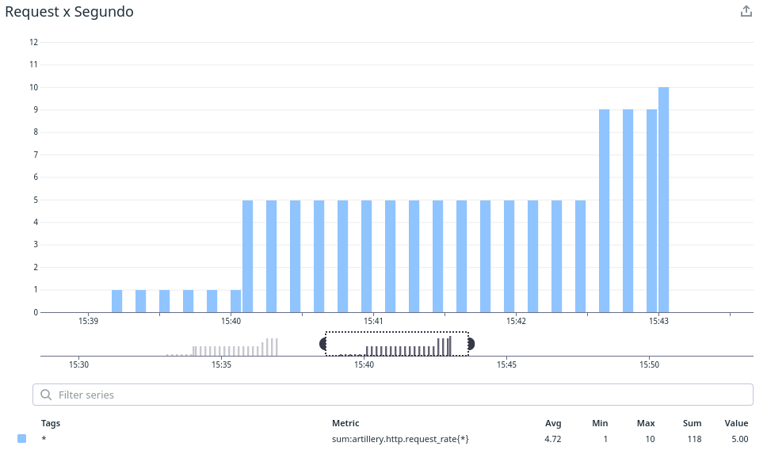

En este primer grafico apreciamos la cantidad de requests por segundo que se le envian al servidor de node.

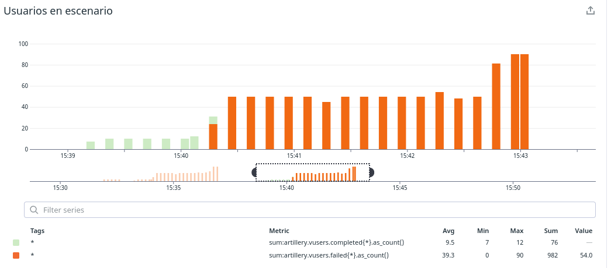

En este grafico podemos ver en verde los requests enviados que lograron completarse exitosamente, mientras que en rojo vemos aquellos requests que fallaron. Estamos en un escenario donde apenas se empiezan a aumentar la cantidad de requests por segundo, los mismos empiezan a fallar.

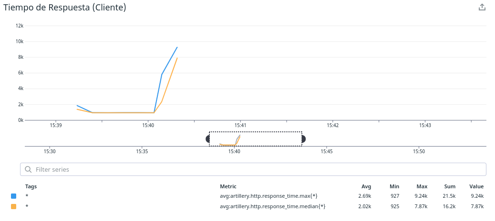

En este grafico podemos apreciar el tiempo de respuesta de los requests. Vemos que si bien inicialmente el tiempo se mantiene constante, en un determinado punto empieza a aumentar muy rapidamente. Este momento coincide con el momento donde se comenzaron a enviar mas requests por segundo (esto podemos constatarlo con el grafico anterior). Luego directamente el servidor deja de responder, presumiblemente por la cantidad de requests que se acumularon. Vemos que ambos graficos tienen sentido juntos.

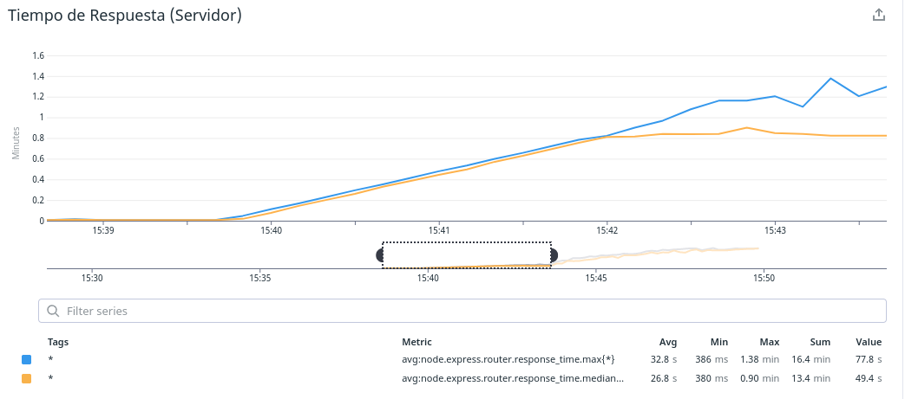

En este grafico podemos ver el tiempo de respuesta que demora el servidor de node, y vemos como este tiempo se mantiene constante inicialmente y luego comienza a aumentar cuasi-linealmente.

Lo que podemos inferir de este primer analisis es que al enviarle una request por segundo al servidor de node todo parece funcionar bien y no hay demora en las responses. Luego, al comenzar a enviar 5 requests por segundo ya saturamos el servidor y los tiempos de response aumentan mucho. Vemos con esto que el límite de correcto funcionamiento es menor a 5 requests por segundo. Intentaremos encontrar este límite con mayor exactitud en los siguientes analisis.

Ahora repetiremos el escenario antes presentado pero en lugar de llegar a 5 requests por segundo, llegaremos a 3 requests por segundo.

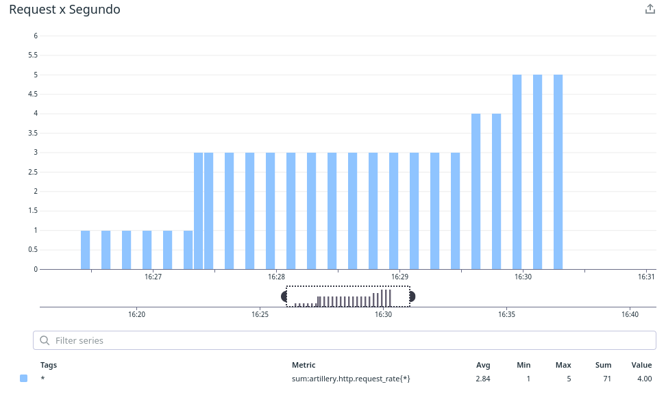

Vemos en este grafico, similar al presentado en la prueba anterior, las requests por segundo que se le envian al servidor de node.

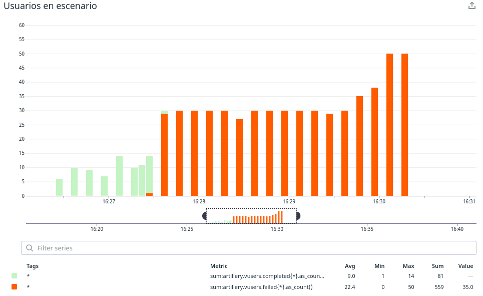

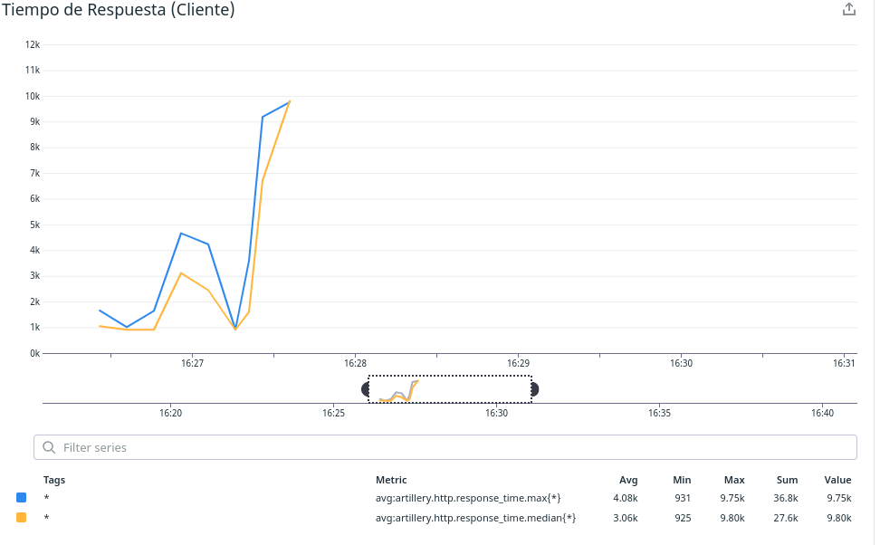

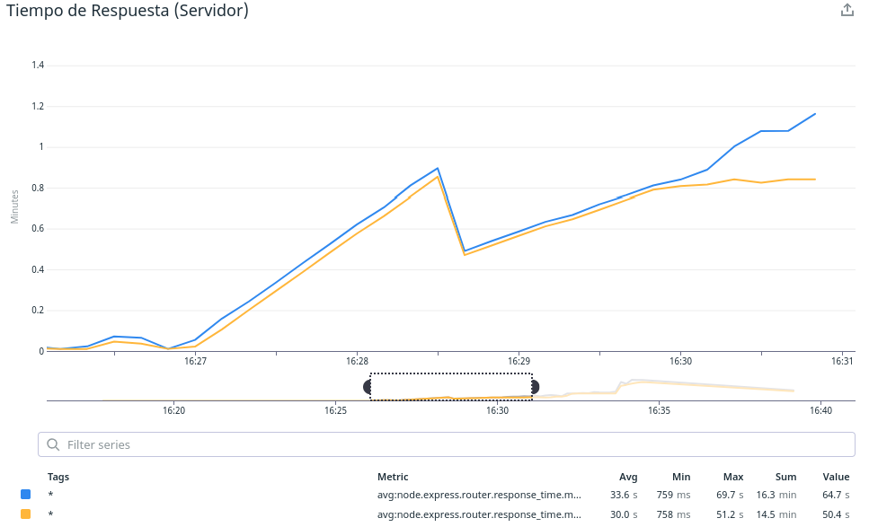

Vemos un caso similar al anterior, donde las requests que envia el usuario inicialmente tienen resultados satisfactorios pero luego de que comienzan a aumentar las requests por segundo, el servidor cada vez tarda mas, es decir aumenta su tiempo de respuesta, y aumentan tambien la cantidad de requests fallidas.

La diferencia de este caso con el anterior es que aquí se tarda mas tiempo en saturar el servidor, producto de que redujimos la cantidad de requests por segundo. Nuevamente debemos reducir la cantidad de requests por segundo para encontrar el límite de correcto funcionamiento.

Ahora volveremos a reducir la cantidad de requests por segundo, esta vez llegaremos a 2 requests por segundo. Obtenemos los siguientes graficos que analizaremos luego de presentarlos:

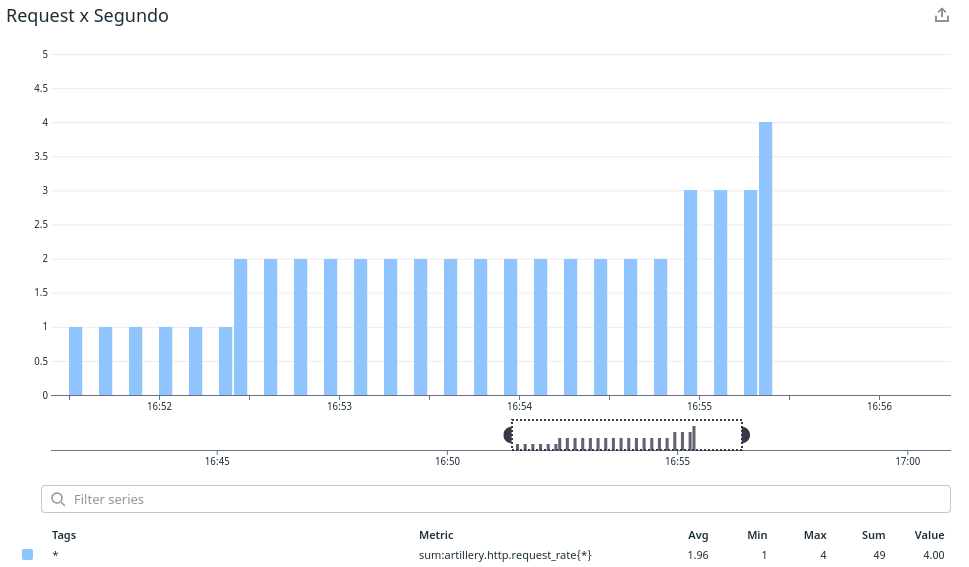

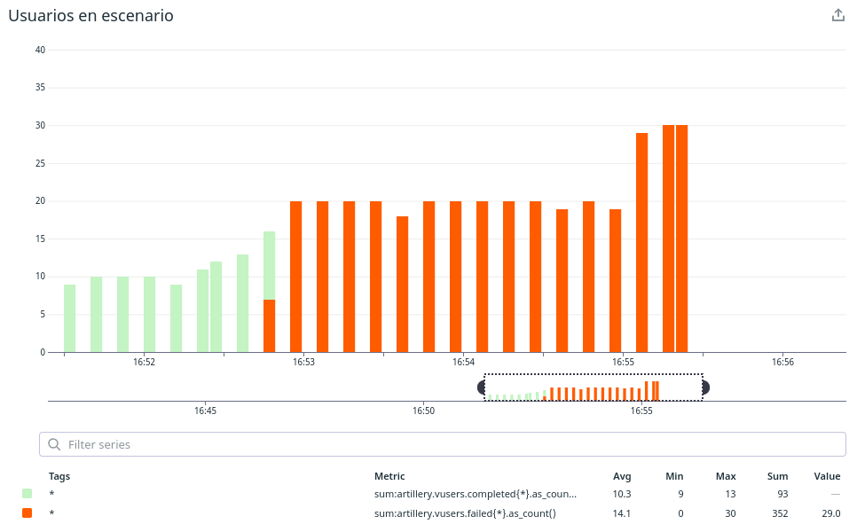

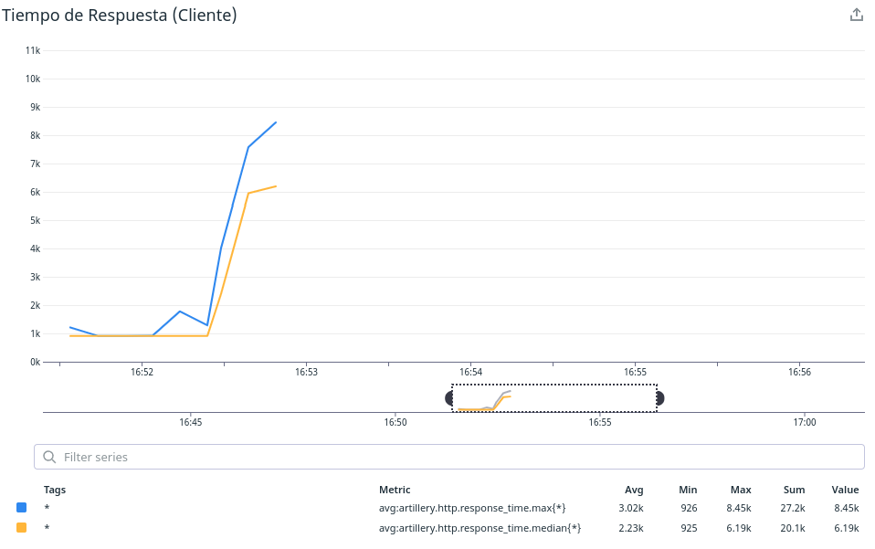

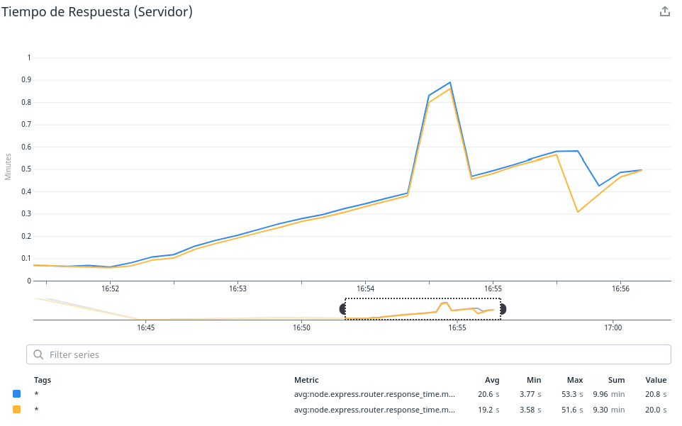

Nuevamente podemos apreciar que el servidor se satura, pero siguiendo con la tendencia del anterior experimento, vemos que tarda mas en hacerlo y que la cantidad de requests completados es aun mayor. Lo que nos esta indicando esto es que la cantidad que puede manejar una sola replica de node, sin que se vea afectada su performance, es entre 1 y 2 requests por segundo. 

Logicamente no tiene sentido en la vida real decir que mandamos 1 request y fracción de otro, es decir no se pueden fraccionar los requests. Para obtener un valor exacto y que tenga sentido podriamos hablar de cada cuantos segundos mandamos un requests, ya que los segundos si podemos fraccionarlos.

## Estudio 2 - Node Replicado x3

## Estudio 3 - Node Singular con Redis
