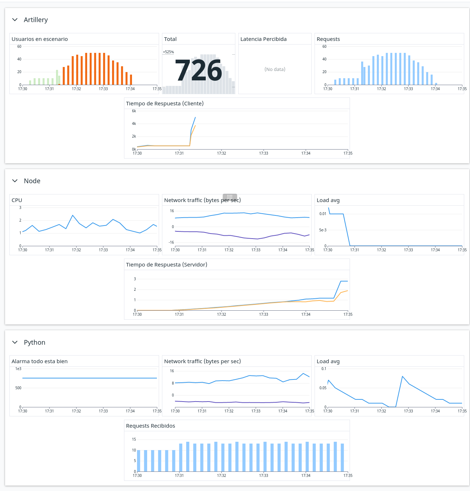
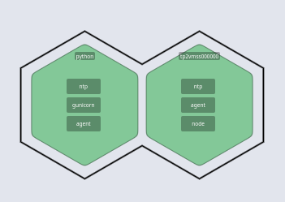
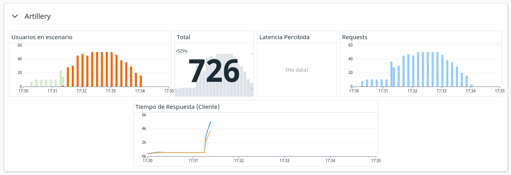
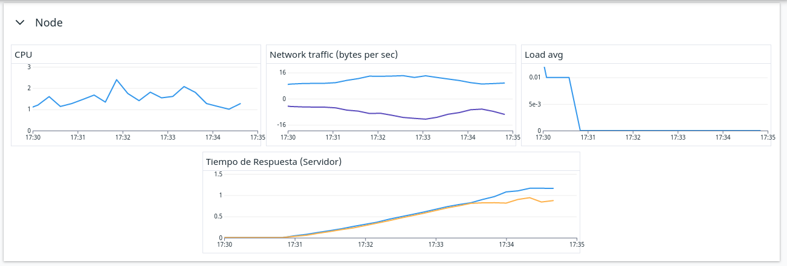
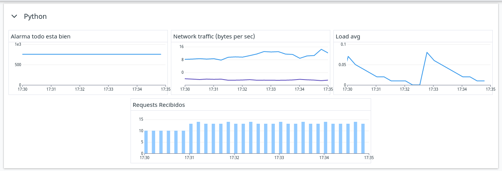
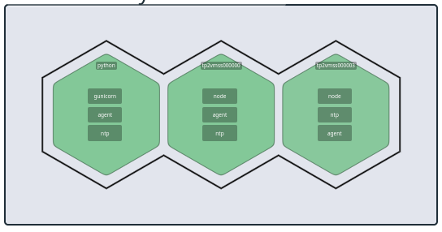

# Trabajo Práctico 2

En este trabajo buscamos hacer un análisis de un sistema en distintas configuraciones, intentando encontrar el cuello de botella que lo limita.

Específicamente, nuestro sistema se compone de un cluster de instancias de aplicaciones de `express` (`node.js`) que a su vez llaman a un servidor de `gunicorn` (`python`).


```bash
# Pingueamos a nuestro Azure Virtual Machine Scale Set
# Este cluster funciona como load balancer y delega el ping a alguna de las instancias de node.js
$ curl "http://ladrillo-fdm.eastus.cloudapp.azure.com"
Hello World!

# Pingueamos al VMSS, pero esta vez le pedimos a `/remote` en vez de `/`
# Este endpoint hace un llamado externo al servidor de gunicorn
$ curl "http://ladrillo-fdm.eastus.cloudapp.azure.com/remote"
{"id":1}
```

Los casos que queremos analizar son:

- ¿Qué pasa si solo tengo una instancia de `node`?
- ¿Qué pasa si el cluster, cual load balancer, delega a 3 instancias de `node`?
- ¿Qué pasa si a una única instancia de `node` le agrego una cache de `Redis`?

---

Nuestras pruebas consisten de correr el mismo escenario de `artillery` para todas las configuraciones de nuestro sistema, para así tener puntos de comparación.

```bash
# Llamamos al escenario de artillery sobre el endpoint `/remote`
# El escenario consiste de correr `ping.yaml` el cual es nada más unos llamados a `/` para ver cuanta latencia estamos manejando actualmente, y luego correr `scenario.yaml` que contiene el flujo principal de WarmUp + RampUp + Plain + CleanUp
$ cd perf
$ ./run.sh "/remote"
All VUs finished. Total time: 4 minutes, 16 seconds

--------------------------------
Summary report
--------------------------------

vusers.created: ................................................................ 715
http.requests: ................................................................. 715
http.request_rate: ............................................................. 2/sec
```

El escenario corrido finalmente impacta en Datadog, ya que todos los componentes de nuestro sistema tienen distintos agentes que reportan métricas. Es con esto que nos vamos a dar una idea de donde estan los distintos cuellos de botella que buscamos.


\newpage

Para el análisis hicimos un _dashboard_, para ver como funciona y se relaciona cada componente:



- Localmente, nos interesan las métricas que envía `artillery`
    - Los usuarios completados y fallidos nos muestra donde esta el punto de quiebre del sistema
    - Los requests por segundo nos muestra el patrón que armó nuestro escenario
    - El tiempo de respuesta nos muestra el punto de vista del cliente, que nos sirve para compararlo con el resto del sistema
    - El número total de usuarios armados nos ayuda a confirmar que estamos efectivamente analizando un escenario entero (en vez de uno parcialmente, o el fin de uno y el comienzo de otro)
    - La latencia percibida nos da una gran idea de cuanto estamos perdiendo en el trayecto desde la computadora local hasta la instancia de la VMSS, porque surge de llamados a `/` y no a `/remote`. Es decir, al restarle este número a el tiempo de respuesta a `/remote`, podemos aproximar cuanto esta tardando la máquina de `node` en llamar a la máquina de `python`

- Luego tenemos los análisis de una de las instancias de `node`
    - El tráfico de red, el consumo de CPU y el _load average_ nos sirven para ver como esta trabajando la máquina, y así poder buscar donde esta llegando a los picos y se esta saturando.
    - El tiempo de respuesta ahora podemos verlo tambien desde el servidor, y compararlo con el punto de vista del cliente

- Finalmente tenemos los gráficos de la máquina de `gunicorn`, de la cual teóricamente no tenemos información ni acceso, pero que aun así nos es funcional al análisis
    - La "alarma todo esta bien" nos muestra que... todo esta bien. Viendo el código sabemos que todos los pedidos tienen un `sleep(0.75)`. Es por eso que este gráfico _siempre_ debe ser una línea de 750 milisegundos, con o sin cortes intermedios.
    - El tráfico de red y el _load average_ de esta máquina cumplen el mismo propósito de las instancias de `node`
    - Los requests recibidos nos sirven para ver si efectivamente hubo un llamado a esta máquina: ya que nuestro escenario envía request frecuentemente y sin pausa, un corte nos significará que nunca hubo un llamado y que el solicitante resolvio el pedido por si mismo (con una cache!)

---

TO DO: Entonces... ¿Qué pretendemos ver?

- Verde al principio, rojo despues en single
- etc etc etc

\newpage

## Estudio 1 - Node Singular

La configuración a analizar consiste de una sola instancia de la máquina de `node`, sin ningun tipo de cache, que recibe todo lo que se le pregunte a la VMSS y, al recibir un pedido a `/request`, hace un llamado remoto a la máquina de `gunicorn`.



Vamos a analizar una corrida de 4 minutos, 16 segundos, de la cual (sin contar los 5 usuarios creados para el `ping` inicial) se completaron exitosamente 93 de los 726 usuarios creados en el escenario.

```bash
$ ./run.sh "/remote"
All VUs finished. Total time: 4 minutes, 16 seconds

--------------------------------
Summary report @ 17:34:02(-0300)
--------------------------------

errors.ETIMEDOUT: .............................................................. 633
http.codes.200: ................................................................ 93
http.request_rate: ............................................................. 3/sec
http.requests: ................................................................. 726
http.responses: ................................................................ 93
vusers.completed: .............................................................. 93
vusers.created: ................................................................ 726
vusers.failed: ................................................................. 633
```

Los usuarios fallidos son todos por el mismo motivo: `ETIMEDOUT`. Por defecto, `artillery` tiene un tiempo de espera de 10 segundos antes de salir con error. Este número nos parece bien elegido y no lo vamos a modificar: si un pedido tarda más de 10 segundos, vamos a tomarlo como fallido, y vamos a considerar que estamos acercandonos al punto de quiebre del sistema.

Ojo, esto no significa que la instancia de `node` haya dejado de funcionar. Simplemente tardo mucho en respondernos. Desde su lado, tranquilamente `node` sigue recibiendo pedidos y llamando al servicio externo. Esto lo podremos chequear más adelante!



Claramente se puede ver que el sistema comienza a fallar en la fase de `RampUp`, de manera casi instantanea: se disparan los tiempos de respuesta, y los usuarios \textcolor{Mahogany}{fallidos} comienzan a superar enteramente a los usuarios \textcolor{OliveGreen}{completados}.

En esta fase es en donde apenas se empiezan a aumentar la cantidad de requests a más de una por segundo. Es decir: **con solo una instancia, el sistema no tolera más de 2 usuarios por segundo**. Intentar decir "esta alrededor de 1.7 requests por segundo" es un análisis complejo: no tiene sentido en la vida real decir que mandamos 1 request y fracción de otro[^1], es decir no se pueden fraccionar los requests. Para obtener un valor exacto y que tenga sentido podriamos hablar de cada cuantos segundos mandamos un requests.

[^1]: Como bien nos enseña el fundador de artillery en la [sección de issues](https://github.com/artilleryio/artillery/issues/279#issuecomment-289203535)



Desde el punto de vista del servidor, tambien vemos que el punto de quiebre esta alrededor de las `17:31:30hs`. Es en donde comenzo el `RampUp` y es en donde se tiene el pico global de uso de CPU.

Lo interesante del tiempo de respuesta (tanto desde el cliente como desde el servidor) es que se puede ver que es lineal en relación al `RampUp`. Comienza constante, y al empezar a recibir más de un usuario, crece linealmente.

El gráfico de tráfico de red nos muestra que la instancia sigue recibiendo información: todavía está llamando al servicio externo, incluso después de haber pasado el `RampUp`. El servicio externo no estaría pareciendo ser el factor limitante, sigue funcionando! El factor limitante parece ser solamente como nuestra instancia de `node` maneja pedidos en simultaneo.



Finalmente, podemos ver que desde el servicio externo todo funciona correctamente. Se recibieron todos los requests, se manejaron correctamente,y siempre se mantuvo constante el tiempo de demora de 750ms.

\newpage

## Estudio 2 - Node Replicado x3

Explicar como cambio el dashboard:
- Hacer un grupo "Cluster de nodes" que tenga las 3 lineas de requests recibidos, cosa de que podamos ver a quien le esta delegando el load balancer. "Un gráfico de todas los requests de todas las instancias de `node` nos muestra como esta funcionando el _load balancer_ y si alguna instancia en particular se esta saturando más que el resto."




\newpage

## Estudio 3 - Node Singular con Redis

Explicar como cambio el dashboard:
- Estaria barbaro ponerle una linea en roja los 750 milisegundos. Si estas arriba de ahí, asumis que hubo llamado sin cache, si no, asumis que hubo llamado con cache.
- Poner disk usage o algo asi? que nos da redis?


