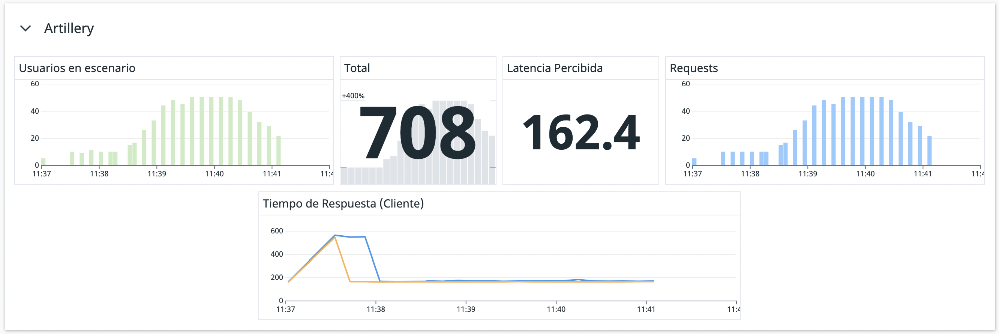
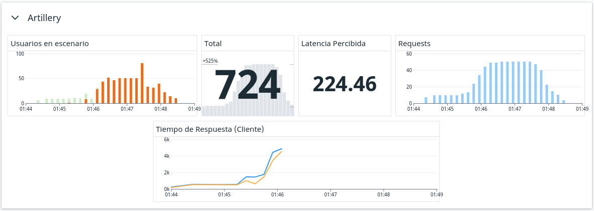

# Trabajo Práctico 2

En este trabajo buscamos hacer un análisis de un sistema en distintas configuraciones, intentando encontrar el cuello de botella que lo limita.

Específicamente, nuestro sistema se compone de un cluster de instancias de aplicaciones de `express` (`node.js`) que a su vez llaman a un servidor de `gunicorn` (`python`).


```bash
# Pingueamos a nuestro Azure Virtual Machine Scale Set
# Este cluster funciona como load balancer y delega el ping a alguna de las instancias de node.js
$ curl "http://ladrillo-fdm.eastus.cloudapp.azure.com"
Hello World!

# Pingueamos al VMSS, pero esta vez le pedimos a `/remote` en vez de `/`
# Este endpoint hace un llamado externo al servidor de gunicorn
$ curl "http://ladrillo-fdm.eastus.cloudapp.azure.com/remote"
{"id":1}
```

Las tres configuraciones que queremos analizar son:

- ¿Qué pasa si sólo tenemos una instancia de `node`?
- ¿Qué pasa si a una única instancia de `node` le agregamos una cache de `Redis`?
- ¿Qué pasa si el cluster delega a 2 instancias de `node` balanceando la carga?

\newpage

Nuestras pruebas consisten en correr el mismo escenario de `artillery` para todas las configuraciones de nuestro sistema, para así tener puntos de comparación.

```bash
# Llamamos al escenario de artillery sobre el endpoint `/remote`
# El escenario consiste en correr `ping.yaml` el cual es nada más unos llamados a `/` para ver cuánta latencia estamos manejando actualmente, y luego correr `scenario.yaml` que contiene el flujo principal de WarmUp + RampUp + Plain + CleanUp
$ cd perf
$ ./run.sh "/remote"
All VUs finished. Total time: 4 minutes, 16 seconds

--------------------------------
Summary report
--------------------------------

vusers.created: ................................................................ 717
http.requests: ................................................................. 717
http.request_rate: ............................................................. 2/sec
```

El escenario corrido finalmente se refleja en Datadog, ya que todos los componentes de nuestro sistema tienen distintos agentes que reportan métricas. A partir de ello, nos daremos una idea de dónde estan los distintos cuellos de botella que limitan nuestro sistema.


\newpage

Para el análisis hicimos un _dashboard_[^1], para ver cómo funciona y se relaciona cada componente.

[^1]: El dashboard fue exportado como `JSON` a `./ddog-dashboard.json` para ayudar con la réplica del estudio.


- Localmente, nos interesan las métricas que envía `artillery`:
    - Los usuarios completados y fallidos nos muestran dónde está el punto de quiebre del sistema.
    - Los requests por segundo nos muestran el patrón que armó nuestro escenario.
    - El tiempo de respuesta nos muestra el punto de vista del cliente, que nos sirve para compararlo con el resto del sistema.
    - El número total de requests nos ayuda a confirmar que estamos efectivamente analizando un escenario entero (en vez de uno parcialmente, o el fin de uno y el comienzo de otro).
    - La latencia percibida nos da una gran idea de cuánto estamos perdiendo en el trayecto desde la computadora local hasta la instancia de la VMSS, porque surge de llamados a `/` y no a `/remote`. Es decir, al restarle este número al tiempo de respuesta de `/remote`, podemos aproximar cuánto está tardando la máquina de `node` en llamar a la máquina de `python`.

- Luego tenemos las métricas de una de las instancias de `node`:
    - El tráfico de red, el consumo de CPU y el _load average_ nos sirven para ver cómo está trabajando la máquina, y así poder buscar dónde se producen los picos y se está saturando.
    - El tiempo de respuesta ahora podemos verlo también desde el servidor, y compararlo con el punto de vista del cliente.

- Finalmente, tenemos los gráficos de la máquina de `gunicorn`, de la cual teóricamente no tenemos información ni acceso, pero que aun así nos es funcional al análisis:
    - La "alarma todo está bien" nos muestra que el servicio está funcionando correctamente. Viendo el código sabemos que todos los pedidos tienen un `sleep(0.75)`, es por eso que este gráfico _siempre_ debe ser una línea de 750 milisegundos, con o sin cortes intermedios.
    - El tráfico de red y el _load average_ de esta máquina cumplen el mismo propósito de las instancias de `node`.
    - Los requests recibidos nos sirven para ver si efectivamente hubo un llamado a esta máquina: ya que nuestro escenario envía requests frecuentemente y sin pausa, un corte nos significaría que nunca hubo un llamado y que el solicitante resolvió el pedido por sí mismo (¡con una cache!).

\newpage

## Estudio 1 - Node Singular

La configuración a analizar consiste de una sola instancia de la máquina de `node`, sin ningún tipo de cache, que recibe todo lo que se le pregunte a la VMSS y, al ingresar un pedido a `/remote`, hace un llamado remoto a la máquina de `gunicorn`.


Vamos a analizar una corrida de 4 minutos y 16 segundos, de la cual (sin contar los 5 usuarios creados para el `ping` inicial) se completaron exitosamente 93 de los 726 usuarios creados en el escenario.

```bash
$ ./run.sh "/remote"
All VUs finished. Total time: 4 minutes, 16 seconds

--------------------------------
Summary report @ 17:34:02(-0300)
--------------------------------

errors.ETIMEDOUT: .............................................................. 633
http.codes.200: ................................................................ 93
http.request_rate: ............................................................. 3/sec
http.requests: ................................................................. 726
http.responses: ................................................................ 93
vusers.completed: .............................................................. 93
vusers.created: ................................................................ 726
vusers.failed: ................................................................. 633
```

Los usuarios fallidos son todos por el mismo motivo: `ETIMEDOUT`. Por defecto, `artillery` tiene un tiempo de espera de 10 segundos antes de salir con error. Este número nos parece apropiadamente elegido: si un pedido tarda más de 10 segundos, vamos a tomarlo como fallido, y vamos a considerar que estamos acercándonos al punto de quiebre del sistema.

Como aclaración, esto no significa que la instancia de `node` haya dejado de funcionar, sino que simplemente tardó mucho en respondernos. Desde su lado, tranquilamente `node` sigue recibiendo pedidos y llamando al servicio externo. Esto todavía no lo sabemos, pero lo vamos a confirmar más adelante.


Claramente se puede ver que el sistema comienza a fallar en la fase de `RampUp`, de manera casi instántanea: se disparan los tiempos de respuesta, y los usuarios \textcolor{Mahogany}{fallidos} comienzan a superar enteramente a los usuarios \textcolor{OliveGreen}{completados}.

En esta fase es en donde apenas empiezan a aumentar la cantidad de requests a más de una por segundo. Es decir: **con sólo una instancia, el sistema no tolera más de 2 usuarios por segundo**. Intentar decir "está alrededor de 1.7 requests por segundo" es un análisis complejo: no tiene sentido en la vida real decir que mandamos 1 request y fracción de otro[^2], es decir no se pueden fraccionar los requests.

[^2]: Como bien nos enseña el fundador de artillery en la [sección de issues](https://github.com/artilleryio/artillery/issues/279#issuecomment-289203535)


Desde el punto de vista del servidor, también vemos que el punto de quiebre se encuentra alrededor de las `17:31:30hs`. Es en donde comienza el `RampUp` y se tiene el pico global de uso de CPU.

Lo interesante del tiempo de respuesta (tanto desde el cliente como desde el servidor) es que se puede ver que es lineal en relación al `RampUp`. Comienza constante, y al empezar a recibir más de un usuario, crece linealmente.

<!-- REVISAR El gráfico de tráfico de red nos muestra que la instancia sigue recibiendo información: todavía está llamando al servicio externo, incluso después de haber pasado el `RampUp`. El servicio externo no estaría pareciendo ser el factor limitante,: sigue funcionando. El factor limitante parece ser solamente cómo nuestra instancia de `node` maneja pedidos en simultáneo. -->


Finalmente, podemos ver que desde el servicio externo todo funciona de manera estable. Se reciben pedidos y siempre se mantuvo constante el tiempo de demora de 750ms.

Sin embargo, algo que se puede notar en el gráfico es que incluso a las `17:35hs` el servicio externo sigue recibiendo pedidos en el patrón `Plain` en vez de `CleanUp`. Pero, conociendo nuestro escenario corrido, sabemos que para esta hora deberíamos estar dejando de recibir requests. Entonces, ¿dónde estan los pedidos que faltan?


Si nos fijamos una franja horaria más extensa podemos confirmar que todos los pedidos se están recibiendo, pero en el rango de 10 minutos en vez de 5. Con este dato faltante podemos terminar nuestro rompecabezas y concluir que el cuello de botella esta en el pedido entre `node` y `python`.

Lo que asumimos que sucede es que `node` de manera asincrona envía todos los pedidos que recibe al servidor externo, mientras que `python` por su lado va encolando cada respuesta que dará. Por lo tanto, al solo tener una instancia que se queda esperando la respuesta del servicio externo, para así responderle al cliente, todo el proceso se ve bastante demorado y casi todas las respuestas terminan superando los 10 segundos de _time out_ que marcamos.

\newpage

## Estudio 2 - Node Singular con Redis

En este escenario, analizamos la configuración de una sola máquina de `node`, pero con un cache de Redis intermedio entre `node` y el servicio externo en `python`.

```bash
# Confirmamos que `/remote/cached` es más rápido que `/remote/`
# Veamos el primer hit y los últimos 4, así ya tenemos la cache en uso
$ for run in {1..15}; do time curl "http://ladrillo-fdm.eastus.cloudapp.azure.com/remote/;" done
{"id":1}
curl "http://ladrillo-fdm.eastus.cloudapp.azure.com/remote/" 1,086 total
...
{"id":1}
curl "http://ladrillo-fdm.eastus.cloudapp.azure.com/remote/" 1,086 total
{"id":1}
curl "http://ladrillo-fdm.eastus.cloudapp.azure.com/remote/" 1,087 total
{"id":1}
curl "http://ladrillo-fdm.eastus.cloudapp.azure.com/remote/" 1,085 total
{"id":1}
curl "http://ladrillo-fdm.eastus.cloudapp.azure.com/remote/" 1,083 total
$ for run in {1..15}; do time curl "http://ladrillo-fdm.eastus.cloudapp.azure.com/remote/cached"; done
{"id":1}
curl "http://ladrillo-fdm.eastus.cloudapp.azure.com/remote/cached" 1,128 total
...
{"id":1}
curl "http://ladrillo-fdm.eastus.cloudapp.azure.com/remote/cached" 0,334 total
{"id":1}
curl "http://ladrillo-fdm.eastus.cloudapp.azure.com/remote/cached" 0,330 total
{"id":1}
curl "http://ladrillo-fdm.eastus.cloudapp.azure.com/remote/cached" 0,331 total
{"id":1}
curl "http://ladrillo-fdm.eastus.cloudapp.azure.com/remote/cached" 0,332 total

# Por supuesto, nunca hay que olvidarse de limpiar el cache entre prueba y prueba
curl "http://ladrillo-fdm.eastus.cloudapp.azure.com/remote/cached" -vX DELETE
```

En el Estudio 1 vimos que el cuello de botella se encontraba en el pedido al servicio externo, por lo tanto nuestra hipótesis es que agregando una cache intermedia los tiempos de respuesta van a mejorar sustancialmente.

La prueba de Artillery realizada fue la misma que en el Estudio 1, con las fases de `ping`, `WarmUp`, `RampUp`, `Plain` y `CleanUp`, y usando el endpoint `/remote/cached/`.

Además, cabe aclarar que para estos escenarios utilizamos una configuración de `cacheKeyLength` de 10. Esto define el tamaño de la cache y por tanto la cantidad de keys que va a soportar Redis, por lo que mientras más grande sea, más requests serán necesarias para llenarla. Al ser de tamaño 10, los primeros 10 requests no hacen hit en la cache y siguen de largo hacia el servicio externo, pero a partir del request 11, se empieza a usar la cache.



En las métricas del lado de Artillery (usuario), podemos apreciar, en primer lugar, que todos los requests del escenario fueron completados con éxito sin fallas, esto nos da un indicio de que la mejora aplicada fue de grán utilidad.

Si observamos el tiempo de respuesta, vemos cómo hay un pico al inicio y después se desciende y se mantiene constante en un nivel muy bajo. El pico se condice con los primeros 10 requests que `node` hace a `python` y no están cacheados aún. El descenso y planicie comienzan partir del siguiente request, donde todos empiezan a ser hit en la caché y no hay necesidad de tener que llegar al servicio externo.


Observando las métricas del lado del servidor de `node`, vemos que el tiempo de carga promedio y el tiempo de respuesta tienen sus máximos al comienzo, mientras se llena la cache, y luego van en descenso una vez que la cache está completa. Esto es coherente con las métricas de Artillery analizadas previamente.


Por último, si vemos del lado de `python`, notamos que la cantidad de requests recibidos son 10 en total (7, 2 y 1). Esto confirma el hecho de que estamos usando una cache de tamaño 10 y que una vez llena, todos los requests que saldrían de `node` hacia `python` no se terminan haciendo porque su respuesta ya se encuentra en Redis.

La alarma todo esta bien nos muestra exáctamente lo que dijimos que mostraría: una linea constante con un corte. Atiende los primeros 10 pedidos, y luego deja de llamarse al `sleep` de `python`. Si tuviesemos el ambiente con 2 replicas, acá veríamos dos líneas entrecortadas.

Realizamos además, una segunda prueba donde enviamos 50 requests por segundo:


Según las métricas desde el lado de artillery, nuevamente todos los request fueron completados sin fallas. Si bien esta cantidad supera a la cantidad de requests de la primera prueba, vemos que esto no genera un problema para el sistema ya que puede manejarlos satisfactoriamente.


<!-- Load average no debería iniciar siendo mayor también en este caso? -->


Observando del lado de `python`, vemos que sucede lo mismo que en la primer prueba de este mismo estudio ya que el tamaño de la cache sigue siendo 10. Entonces, al igual que antes, los requests que saldrían de `node` hacia `python` no se terminan haciendo porque su respuesta ya se encuentra en Redis.

Podemos concluir para este estudio que el hecho de agregar una cache intermedia, al menos con el tamaño de cache propuesto (10), mitiga el cuello de botella que se generaba al recurrir al servicio externo.

\newpage

## Estudio 3 - Node Replicado x2

Para este analisis se utilizaran dos instancias de `node`[^3] y el endpoint al que llamaremos será nuevamente `/remote`, ya que no queremos utilizar ningún tipo de cache en esta configuración.

[^3]: Originalmente teníamos pensado hacer un ambiente con 3 réplicas, pero nuestra suscripción actual de Azure solo nos permite tener 4 CPUs virtuales a la vez, y eso lo tenemos al límite: `mgmt`, `python`, `node1`, `node2`. 


Inicialmente lo que esperaríamos ver es un escenario más parecido al caso 1, donde efectivamente veamos que nuevamente se sobrecargue el sistema debido a la ausencia de cache, pero que ocurra más adelante en la prueba.



Viendo inicialmente las métricas provistas por artillery, podemos ver que efectivamente se sobrecarga el sistema. Esto podemos notarlo en el gráfico de "Usuarios en escenario" ya que durante la fase de `RampUp` comienzan a verse usuarios fallidos hasta superar totalmente a los usuarios completados.

A su vez, en el gráfico de "Tiempo de respuesta" podemos ver cómo comienza a aumentar pronunciadamente en el mismo momento que comienza a sobrecargarse el sistema con usuarios.

<!-- Revisar -->
Respecto a los gráficos que habíamos observado cuando usamos una única instancia de node, podemos ver que la performance no mejora prácticamente nada. El motivo de esto es que el cuello de botella que genera la caída de rendimiento y la perdida de requests esta en el servicio externo! Por eso, a pesar de agregar una nueva instancia de node no vemos mejoras, porque el problema nunca fue nuestra instancia de node.

Esta ultima afirmación constata con el caso anterior, donde vimos que al agregar una cache entre nuestra instancia de node y el servicio externo de python, sí vimos una gran mejora en el rendimiento.


Para este caso de estudio modificamos el dashboard para poder graficar ambas VMs por separado, es por eso que ahora tanto el CPU como el _load average_ tienen dos líneas, una por cada instancia. Es con este nuevo gráfico que podemos darnos una idea de como está el _load balancer_ delegando el trabajo.

Desde el punto de vista del servidor, también vemos que el punto de quiebre se encuentra aproximadamente en el momento en que comienza el `RampUp`.

Nuevamente el tiempo de respuesta del servidor tiene una forma lineal en relación al `RampUp`. Comienza constante, y al empezar a recibir más de un usuario, crece linealmente.


En esta imagen, podemos apreciar que en el servicio externo todo funciona correctamente. Se recibieron todos los requests, se manejaron correctamente, y siempre se mantuvo constante el tiempo de demora de 750ms.

Si bien replicar el servidor de node no es la solución al problema analizado en este trabajo, sí tiene utilidades. Supongamos el sistema con cache que mostramos en el item anterior, si a ese sistema se le enviaran muchísimas requests por segundo, es probable que el mismo colapse pero no por la cache, sino porque la única replica de node que funciona allí no puede manejar tantos requests (antes de enviárselos al servicio externo). En ese caso, sí sería útil tener más réplicas de node para poder distribuir la carga entre ellas antes de enviar sus respectivos requests al servicio externo con cache en el medio.

\newpage

## Conclusiones

En el presente trabajo práctico pudimos comprender y poner en práctica diversos conceptos y herramientas como fueron servicios cloud, herramientas de monitoreo cloud, ansible, una gama de servicios de Azure, y demás.

Nos fue posible entender qué se nos estaba pidiendo y cómo lograrlo, además de formular hipótesis sobre los resultados que creímos que íbamos a obtener. Luego tuvimos la oportunidad de verificar dichas hipótesis contra las métricas que obtuvimos, y conseguimos comprobar algunas y descartar otras.

Pudimos comprender cómo resolver el problema planteado, lo cual resultó muy provechoso para entender cómo funcionan los servicios cloud y cómo se pueden utilizar para resolver problemas de esta naturaleza. Vimos que si bien uno podría suponer que agregar réplicas de node parecía la forma de llevar a cabo el problema propuesto, lo que había que hacer realmente era determinar dónde estaba efectivamente el problema, y buscar soluciones a éste, como por ejemplo introducir una cache.
